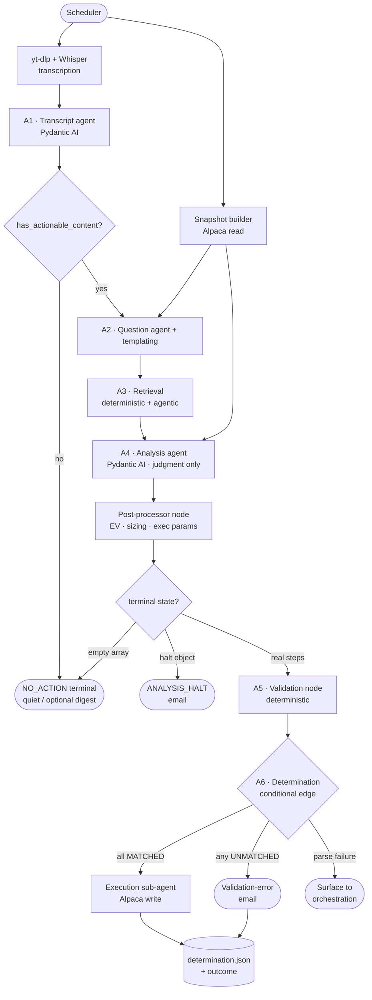

# money-pit — Architecture Specification

**Status:** draft · **Companion document:** `pipeline_contracts.md` (authoritative per-boundary
schemas) · **Scope:** the scheduled video-to-trade analysis pipeline and its execution/notification
edges.

This document describes *how the system is built and why*. Wire-level schemas live in
`pipeline_contracts.md`; where this spec and that document overlap, the contract document is
authoritative for field-level detail and this document is authoritative for component
responsibilities and control flow.

---

## 1. Purpose & scope

money-pit is a scheduled pipeline that ingests market-commentary videos from a single YouTube
channel, extracts and validates investment signals against current data and the owner's actual
brokerage state, and either **executes** the resulting portfolio actions against a live Alpaca
account or **halts and notifies** a human. It is a personal, single-owner system. Because its output
moves real capital, the architecture privileges reproducibility, auditability, and structural safety
over flexibility.

In scope: ingestion, the six analysis stages, the deterministic post-processing and validation
layers, execution, and notification. Out of scope: portfolio strategy design, model training, and
any interactive UI. The system runs unattended on a schedule and surfaces to a human only through
email and its on-disk audit trail.

---

## 2. Design principles

1. **The LLM does only irreducible judgment.** Turning free text into structure, and forming
   views. Every deterministic computation is a function or a tool, never model output. See §9.
2. **Safety is structural, not prompted.** Scope limits are enforced by *which client holds which
   tools*, not by instructions a model could ignore. Only the execution stage can place an order.
3. **Determinism where capital is at stake.** Identical inputs produce identical action steps.
   Arithmetic, sizing, regime tagging, routing, and validation are code, so this actually holds.
4. **JSON is authoritative; markdown is for humans.** Every stage writes both; on disagreement the
   JSON wins. Nothing downstream parses markdown for a decision.
5. **File-based, inspectable state.** Each run is a self-contained directory. A reviewer can
   reconstruct any decision from the files alone, without re-running anything.
6. **Fail closed, notify loudly.** Any missing input, malformed artifact, unmatched capability, or
   exception halts forward progress and routes to a human. "Nothing to do" is a distinct, quiet
   outcome from "something went wrong."
7. **Conservative bias.** Absent or ambiguous evidence shrinks conviction and size; it never
   inflates them.

---

## 3. System context

```
            ┌──────────────┐         ┌──────────────────────────┐
 YouTube ──▶│              │         │  External data sources    │
 channel    │  money-pit   │◀───────▶│  FRED · SEC EDGAR ·        │
            │  pipeline    │         │  yfinance · Brave         │
 Alpaca ───▶│  (LangGraph) │◀───────▶│  Alpaca (market + orders) │
 account    │              │         └──────────────────────────┘
            └──────┬───────┘
                   │ email (halts / no-trade digest)
                   ▼
            owner: 56kyleoliver@gmail.com
```

External dependencies: a YouTube channel (source of signal), Alpaca (brokerage state + execution),
FRED / SEC EDGAR / yfinance / Brave (research data), an SMTP/email provider (notification), and the
transcription toolchain (yt-dlp + Whisper).

---

## 4. Runtime model

The pipeline runs on a schedule as a single **LangGraph** graph. Each invocation owns a working
directory:

```
data/daily_show/{YYYY-MM-DD_HH-MM-SS}/
```

The directory basename is the run **slug** and is the single source of truth for run identity,
carried in graph state to every node. No node re-derives, reformats, or reads the slug from a file's
contents. All inter-stage state is passed as **files in the working directory** (plus the slug and a
prior-step completion record in graph state). A stage that needs an upstream artifact reads it from
disk; a stage that produces one writes it there. State does not persist across runs; each run is a
clean directory.

This file-based model is deliberate: it makes every run independently replayable and auditable, and
it decouples stages so any one can be re-run in isolation against a frozen working directory.

---

## 5. Pipeline topology



The graph is mostly linear with three gates: the **signal gate** after A1 (skip everything if the
episode has no actionable content), the **terminal-state router** after the post-processor (empty /
halt / proceed), and the **determination gate** after validation (proceed to execution only if every
step is independently executable).

---

## 6. Component catalog

Each component is one of three types: a **Pydantic AI agent** (thin LLM core with a typed output), a
**node** (deterministic LangGraph function), or an **MCP tool** (callable integration). The four
agents are the only places an LLM runs.

### 6.1 Ingestion (nodes)

- **Scheduler** — triggers a run, creates the working directory, seeds graph state with the slug.
- **Transcription node** — yt-dlp pulls the latest video's audio; Whisper transcribes it to text.
  Emits the raw transcript string consumed by A1. (Transcription quality is a known error source;
  A1's `resolve_ticker` tool exists partly to recover from Whisper homophones.)
- **Snapshot builder node** — calls the Alpaca **read** tools and writes `portfolio_snapshot.json`
  (`PortfolioSnapshot`). Computes the aggregate factor profile from per-position `factor_tags`
  deterministically. This snapshot is the single source of truth for portfolio state for the run.

### 6.2 A1 — Transcript agent (Pydantic AI)

- **Responsibility:** comprehend the transcript; identify substantive claims; assign each a tier and
  category; restate it in its own words; extract mentioned tickers / sectors / macro themes; write
  the episode summary.
- **Output type:** `TranscriptSummaryDraft` (judgment + raw entities only).
- **Tools:** `resolve_ticker`.
- **Wrapping node:** adds derived fields (`requires_validation`, `has_actionable_content`),
  normalizes tickers, parses any stated date to ISO 8601, validates and writes `transcript_summary.json/.md`.
- **Gate:** if `has_actionable_content` is false, the run routes directly to `NO_ACTION`.

### 6.3 A2 — Question agent + templating

- **Responsibility:** produce the research questions across the five categories.
- **LLM part (Pydantic AI):** authors only the *claim-specific* `thesis_validation` and
  `invalidation_conditions` questions. Output type: `list[DraftQuestion]`.
- **Node part (deterministic):** emits the standing questions that recur every run as templates —
  the four `macro_regime` questions (constant), per-ticker `current_events` questions
  (parameterized by `published_at`), and per-position `portfolio_gap` questions (filled from the
  snapshot). Merges all questions, assigns `Q###` IDs and ordering, fills `data_sources` from the
  routing table, inserts empty-category placeholders, and writes `initial_questions.json/.md`.
- **Inputs:** `transcript_summary.json`, `portfolio_snapshot.json`.

### 6.4 A3 — Retrieval

- **Responsibility:** answer every question with sourced, honestly-rated data; never fabricate.
- **Node part (deterministic retrieval):** for any question carrying a known tool + params (named
  FRED series, current price, P/E, the bundled macro indicators), a node executes the fetch with no
  model involved, then derives `confidence` from the source used.
- **LLM part (Pydantic AI, thin):** only the open-ended questions needing relevance judgment
  (free-text Brave / EDGAR lookups) plus short answer synthesis. Output type: `AnswerDraft`.
- **Structural constraint:** this stage's Alpaca client exposes **only** market-data tools. Order
  tools are not in scope and cannot be called, by construction.
- **Controls:** per-question call budget enforced by the node, not by model self-policing.
- **Output:** `initial_answers.json/.md`, carrying `category` / `signal_source` / `signal_tier`
  through from each question so A4 can join without re-reading the questions file.

### 6.5 A4 — Analysis agent + post-processor

The system's core, split into a judgment agent and a deterministic compute node.

- **A4 agent (Pydantic AI):** executes the seven-step framework as *judgment only* — Step 1
  supported/contradicted/unverified disposition per claim (after a code join on
  `claim_id ↔ signal_source`), Step 4 thesis narratives, the Step 5 scenario probabilities and
  returns, Step 6 invalidation-condition authoring. Output type: `AnalysisJudgment` (surviving
  theses with scenarios and narratives, dropped-claim records, the macro indicators it read, and an
  optional halt). It reasons only over the three input files; it has no tools and cannot retrieve.
- **Post-processor (node):** consumes `AnalysisJudgment + PortfolioSnapshot` and produces
  `action_steps.json` (`list[ActionStep]`). It performs every deterministic operation: Step 2 regime
  tagging via a decision table, Step 3 constraint extraction (25% sector cap, cash, overlap), Step 5
  `EV = Σ(Pᵢ/100 × Rᵢ)` and the ≥ +3.0% gate, Step 7 sizing (base = equity ÷ 20 × conviction
  multiplier, clamped), direction → `action_type` mapping, probability-sum validation, and emission
  of `execution_parameters` with **manifest-correct field names**. This node is where the
  `ticker→symbol` / `dollar_amount→notional` / `action→side` translation lives — never inside the
  validator. A4 also writes `analysis.md`, the full human-readable reasoning including every drop.

### 6.6 A5 — Validation node (deterministic, no LLM)

- **Responsibility:** for each action step, confirm a literal, complete MCP tool sequence exists that
  would execute it exactly as written. Static analysis only; never executes a tool.
- **Mechanism:** reads the **tool manifest** (introspected from the registered MCP servers) and
  checks existence (tool present by exact name), schema acceptance (every required parameter present
  under its *literal* field name — no semantic remapping), and behavioral match via a fixed
  `action_type → tool` config. With a closed tool set this is entirely deterministic.
- **Output:** `action_steps_validation.json/.md` (per-step `MATCHED`/`UNMATCHED` + gap descriptions)
  and `validation_status.json` (the orchestration completion signal). Written JSON → md → status,
  in that order.

### 6.7 A6 — Determination (conditional edge, no LLM)

- **Responsibility:** recompute the go/no-go from per-step statuses: every step `MATCHED` →
  `PROCEED`; any non-`MATCHED` → `HALT`. A missing/empty/non-array step list, an unreadable file, or
  an unknown status literal is a parse failure → `HALT` with **no** sub-agent spawned, surfaced to
  orchestration. Writes `determination.json` and logs the decision with an explicit reason.
- **Routing:** `PROCEED` → execution sub-agent; step-status `HALT` → validation-error email; parse
  failure → orchestration.

### 6.8 Execution sub-agent (node + Alpaca write tools)

- **Responsibility:** execute the validated steps against the brokerage while staying consistent
  through runtime failures. It holds the *only* client in the system with write access to Alpaca.
- **Type:** a deterministic loop, not an LLM — it places already-validated, already-typed orders.
- **Transactional model (see `pipeline_contracts.md` §7a).** The determination gate already prevents
  executing a plan with an *unmatched* capability, so the residual risk is a runtime failure inside an
  approved plan. Two mechanisms cover it, and neither is a pre-planned static inverse (a trade has no
  true inverse — slippage, partial fills, taxes, one-way doors):
  - **Independent steps re-evaluate; only atomic groups unwind.** Steps with `group_id == null` are
    standalone; if one fails, the successful ones were each independently validated as good and the
    next run re-plans from live state — undoing them would be a mistake. Unwinding applies *only* to
    steps sharing a `group_id` (pairs trade, hedge, funded roll), where a partial fill leaves
    unintended exposure.
  - **Journal + idempotency.** Every order carries a deterministic `client_order_id = {slug}:{step_id}`
    so retries never double-execute, and the sub-agent writes `execution_journal.json` **incrementally**
    so a crash leaves a truthful partial record. This is the durable "what was actually applied" log —
    the transferable half of the Alembic analogy; the down-migration half is deliberately not adopted.
- **Per-group flow:** pre-flight every leg (buying power, shortability, market-open) and place *none*
  if any leg fails; execute legs in safe order (least-harmful-solo-failure first); on a mid-flight leg
  failure, compute compensations from **realized fills** and unwind the filled legs; if a compensation
  itself fails, escalate urgently (`COMPENSATION_FAILED`) — the one state with un-neutralized exposure.
- **Output:** an execution outcome (`EXECUTED_CLEAN` | `PARTIAL_COMPENSATED` | `COMPENSATION_FAILED` |
  `EXECUTION_FAILED`) written to the journal and mapped into `determination.json`.

### 6.9 Notification sub-agent (node + communication tool)

- **Responsibility:** send the owner an email on any halt or escalation path. Subject convention
  `money-pit: <reason> - {slug}`; body templated from the relevant report. An LLM for prose is
  optional, not required.
- **Distinct notifications:** `ANALYSIS_HALT` (A4 could not complete a step), validation-error (A6
  found unmatched capabilities), the **urgent** `COMPENSATION_FAILED` (un-neutralized exposure after a
  failed unwind — its own high-priority subject), and optionally a low-priority `NO_ACTION` digest.
  These are separate subjects and bodies, never conflated.

---

## 7. Data architecture

All artifacts are plain `pydantic.BaseModel`s, validated on write and on read at each boundary. The
ten working-directory artifacts and their producers/consumers:

| artifact | producer | consumers |
|---|---|---|
| `transcript_summary.json/.md` | A1 + wrap node | A2, A4 |
| `portfolio_snapshot.json` | snapshot builder | A2, A4 |
| `initial_questions.json/.md` | A2 | A3 |
| `initial_answers.json/.md` | A3 | A4 |
| `analysis.md` | A4 | human / audit |
| `action_steps.json/.md` | post-processor | A5, execution |
| `action_steps_validation.json/.md` | A5 | A6 |
| `validation_status.json` | A5 | orchestration |
| `determination.json/.md` | A6 | orchestration / audit |
| `execution_journal.json` | execution sub-agent | orchestration (next-run recovery) / audit |

Two-model pattern at LLM boundaries: each agent's typed output is a **draft / judgment** model
(`TranscriptSummaryDraft`, `list[DraftQuestion]`, `AnswerDraft`, `AnalysisJudgment`), and a node
converts it into the full **contract** model that lands on disk. The complete field-level schema for
every model is in `pipeline_contracts.md`; the model inventory (≈25 models + shared enums) is the
build manifest for the data layer.

---

## 8. MCP tool layer

Three servers are built in-house; four are existing community servers wrapped with typed clients.
The Alpaca server is split into **read** and **write** scopes exposed through separate clients — the
central safety boundary of the system.

| server | build/integrate | tools | exposed to | scope |
|---|---|---|---|---|
| Alpaca (read) | build | `get_account_snapshot`, `get_latest_quote`, `get_recent_trades`, `list_assets` | snapshot builder, A3 | read |
| Alpaca (write) | build | `place_order`, `get_order` | **execution only** | write |
| reference | build | `resolve_ticker`, `get_macro_regime_indicators`* | A1, A3 | read |
| communication | build | `send_email` | notification only | write |
| FRED | integrate | `get_series` | A3, macro bundle | read |
| EdgarTools | integrate | `get_filings`, `get_financials`, `get_insider_transactions` | A3 | read |
| yfinance | integrate | `get_fundamentals`, `get_price_history`, `get_earnings` | A3 | read |
| Brave | integrate | `web_search` | A3 | read |

\* `get_macro_regime_indicators` is deterministic and may instead be a plain node over the FRED MCP;
expose it as a tool only if on-demand or cached access is wanted.

The **manifest** A5 validates against is not a tool — it is introspected from the registered server
definitions by a background function and passed to the validator.

---

## 9. Compute allocation

The defining architectural decision: minimize the LLM surface. Placement rule — **MCP tool** for
external integrations or anything a model must call mid-reasoning; **node/function** for deterministic
transforms at a fixed pipeline point; **LLM** only for open-ended language or genuine estimates.

| concern | placement |
|---|---|
| transcript → structured claims, tier/category, entity extraction | **LLM (A1)** |
| claim-specific question authoring | **LLM (A2)** |
| open-ended retrieval + answer synthesis | **LLM (A3)** |
| signal disposition, thesis narratives, scenario estimates, invalidation authoring | **LLM (A4)** |
| derived flags, ticker normalization, date parsing, schema validation | node |
| standing-question templating, IDs, ordering, routing-table `data_sources` | node |
| deterministic known-param retrieval, `confidence` derivation, budget control | node |
| regime tagging, EV + gate, constraint extraction, sizing, exec-param emission | node (post-processor) |
| capability validation (existence + literal schema + sequence) | node (A5) |
| go/no-go determination + terminal-state routing | conditional edge (A6) |
| order placement, email send | node + write-scoped MCP tool |

Net: **four thin LLM cores** (A1, A2, A3, A4); **A5 and A6 contain no LLM**. The two most
consequential judgments that *were* model output — macro regime and position sizing — are now
deterministic, which requires defining the regime decision table and the numeric conviction bands up
front (see §15).

---

## 10. Control flow & terminal states

A run ends in exactly one terminal state, each mapped to a distinct, intended outcome so that a
no-trade day never looks like a failure:

| terminal state | trigger | action |
|---|---|---|
| `NO_ACTION` | A1 signal gate false, or post-processor emits `[]` | stop quietly; optional digest; **no error email**; A5/A6 skipped |
| `ANALYSIS_HALT` | A4 emits a halt object (a step could not be completed) | distinct halt email; A5/A6 skipped |
| `EXECUTED_CLEAN` | A6 `PROCEED` → all steps executed | orders placed; journal + outcome recorded |
| `PARTIAL_COMPENSATED` | an atomic group leg failed mid-flight but filled legs were unwound | net no unintended exposure; recorded as success with journal detail |
| `COMPENSATION_FAILED` | an unwind itself failed — un-neutralized exposure remains | **urgent** high-priority email; flagged for next-run reconciliation |
| `VALIDATION_ERROR` | A6 step-status `HALT` (real unmatched capability) | validation-error email |
| `ORCHESTRATION_ERROR` | A6 parse failure, or any unexpected exception | surface to orchestration; no sub-agent |

The orchestration layer inspects the post-processor output *before* A5 to separate `NO_ACTION` and
`ANALYSIS_HALT` from real recommendations, so the validation-error path fires **only** for genuine
tool-coverage gaps on real steps. The three `EXECUTED_*`/`COMPENSATION_FAILED` outcomes come from the
execution sub-agent's transactional model (§6.8 / contracts §7a); `COMPENSATION_FAILED` is the one
outcome that leaves the portfolio in a state the system could not itself reconcile, so it is the
highest-priority human signal in the system.

---

## 11. Safety & risk controls

Defense in depth, ordered from structural to procedural:

1. **Tool scoping (structural).** Only the execution stage holds an Alpaca client with order tools.
   Analysis and retrieval physically cannot trade. This is the primary control and does not depend on
   model behavior.
2. **Capability gate (A5).** No execution path opens unless *every* action step has a confirmed,
   literal tool sequence. A partially-executable plan halts the whole run.
3. **Determination gate (A6).** Binary, recomputed from per-step statuses, ignoring any summary
   field. Any non-`MATCHED` step forces `HALT`. No "close enough."
4. **Evidence-only analysis (A4).** Every quantitative claim must trace to an input field; missing
   data is never treated as favorable and cannot be filled from model knowledge.
5. **Deterministic sizing with hard limits.** 25% sector cap, available-cash ceiling, and
   correlated-overlap reductions are arithmetic clamps in the post-processor, not model discretion.
6. **Conservative bias.** Unverified signals and `UNCERTAIN` regimes cap conviction and forbid the
   largest size multiplier.
7. **Execution consistency (transactional, §6.8).** Idempotent submission prevents double-execution;
   an incremental journal makes any crash recoverable; interdependent legs execute all-or-nothing with
   pre-flight checks and realized-fill compensation, so the system never silently sits in a half-hedged
   state. The only escape — a failed unwind — is surfaced as the highest-priority alert.
8. **Human-in-the-loop on every halt.** Any abnormal or no-go outcome notifies the owner with a
   reason specific enough to act on.
9. **Replayable audit trail.** Every decision — including every order actually attempted and filled —
   is reconstructable from the working directory.

---

## 12. Observability & audit

The audit standard: a reviewer reading the working directory can reconstruct exactly why a run
executed or halted without re-running anything. Each node logs its decisions with explicit reasons to
the run log and graph state. `analysis.md` carries A4's full step-by-step reasoning including every
dropped claim; `determination.json` records the recomputed go/no-go, the failing step IDs, the
spawned sub-agent, and its terminal outcome. The paired JSON/markdown convention means every machine
decision has a human-readable companion. Validation gaps are recorded specifically (which parameter,
which field, which tool), never as a generic failure.

---

## 13. Technology stack

- **Orchestration:** LangGraph (graph topology, conditional edges, node state, scheduled trigger).
- **Agents:** Pydantic AI for the four LLM cores (typed outputs, MCP toolsets as agent tools,
  dependency injection of working-dir inputs). Confirm exact Pydantic AI parameter names against the
  pinned version.
- **Data layer:** Pydantic v2 models for all artifacts and tool I/O.
- **Integrations:** MCP servers — Alpaca (read/write), reference, communication (in-house); FRED,
  EdgarTools, yfinance, Brave (community).
- **Ingestion:** yt-dlp + Whisper.
- **Brokerage:** Alpaca.

---

## 14. Configuration & environment

Externalized configuration (not in prompts or code constants): the YouTube channel ID; the owner
recipient `56kyleoliver@gmail.com`; Alpaca credentials, split into read-scope and write-scope keys so
the scoping is enforced at the credential level; data-source API keys; the schedule; the sub-agent
timeout window (owned by the LangGraph node definition, not by any agent); the **regime decision
table** and **conviction-band thresholds**; and the `action_type → tool` mapping consumed by A5. The
working-directory root (`data/daily_show/`) is the only persistent on-disk state.

---

## 15. Open decisions & risks

1. **Alpaca order tool schema (blocking).** The `execution_parameters` field names emitted by the
   post-processor must literally match the real `place_order` input schema, or A5 marks every step
   `UNMATCHED`. Pin the schema before building the post-processor.
2. **Regime decision table (design).** The mapping from the four indicators to one of six regime
   tags must be defined explicitly, including the rule that any missing/conflicting indicator →
   `UNCERTAIN`. Auditable, but real upfront work.
3. **Conviction-band thresholds (design).** Replace the prompt's run-relative "top of the surviving
   range" with fixed numeric EV cutoffs for the 1.5× / 1.0× / 0.5× multipliers.
4. **Snapshot vs live reads.** Decide whether A3's live Alpaca quotes may diverge from the
   run-start snapshot for sizing; recommendation: the snapshot wins for all sizing/constraint math.
5. **Sell sizing translation.** `TRIM`/`SELL` express a dollar amount to *remove*; the post-processor
   must translate that into whatever the Alpaca sell tool accepts (notional vs quantity).
6. **Transcription fidelity.** Whisper errors on tickers/numbers are an upstream risk; `resolve_ticker`
   mitigates symbols but not misheard figures — A4's evidence-only rule is the backstop.
7. **Template coverage.** Over-templating A2/A3 trades adaptability for reproducibility; keep the LLM
   for claim-specific and open-ended items so unanticipated topics still route through judgment.
8. **Single-channel dependency.** The system's entire signal supply is one YouTube channel; a change
   in that channel's format or cadence is a systemic input risk.
9. **Interdependence definition (design).** What makes A4 assign a shared `group_id`? Define the
   explicit criteria (pairs trade, hedged entry, funded roll) so grouping is deterministic, not a
   model whim — over-grouping forces needless all-or-nothing; under-grouping leaves real exposure
   ungrouped.
10. **Leg-execution ordering (design).** Within an atomic group, the order that minimizes naked
    exposure on a partial fill (e.g. protective leg before exposed leg). Needs a per-pattern policy.
11. **Compensation cost bound (policy).** A compensation is a real market action with real cost; decide
    whether there is a tolerance beyond which the system should *not* auto-unwind and should instead
    escalate to a human immediately (a very wide spread at unwind time, say).
12. **Recovery semantics (design).** On a prior `COMPENSATION_FAILED` or crashed run, define exactly
    how next-run reconciliation reads the journal + live positions and decides what, if anything, to
    finish or unwind — versus simply re-planning from current state.

---

## 16. Suggested build order

1. **Data layer** — all Pydantic models + enums (the contract). Everything else depends on it.
2. **MCP servers** — Alpaca read/write (scoped), reference, communication; typed wrappers for the
   four community MCPs. Pin the order-tool schema here (resolves risk #1).
3. **Deterministic spine** — snapshot builder, A2/A3 templating + routing, the A4 post-processor,
   A5 validator (incl. the compensation-capability check), A6 edge, terminal-state router, the
   transactional execution loop (idempotency, journal, atomic-group pre-flight + compensation), and
   the email sender. This is a runnable, testable pipeline with stubbed agent outputs and no LLM —
   and it is where the capital-moving logic lives, so test it hardest here, on paper trading.
4. **LLM cores** — A1, A2, A3, A4 as Pydantic AI agents against the typed boundaries.
5. **Wire the graph** — assemble in LangGraph, add the scheduler, logging, and the audit checks.
6. **Dry-run on paper trading** before any live-money execution.
