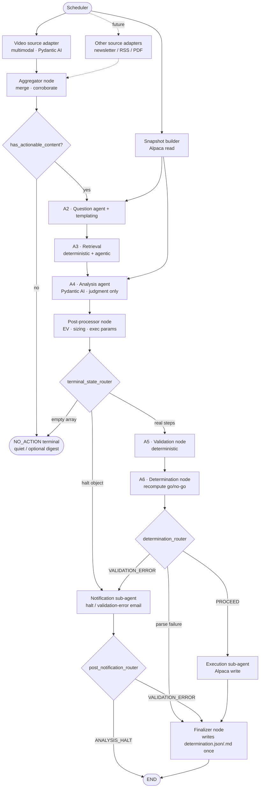

# money-pit — Architecture Specification

**Status:** draft · **Companion documents:** `pipeline_contracts.md` (authoritative per-boundary
schemas), `design_decisions.md` (resolved §15 open decisions: regime table, Kelly sizing, snapshot
semantics, sell translation) · **Scope:** the scheduled video-to-trade analysis pipeline and its
execution/notification edges.

This document describes _how the system is built and why_. Wire-level schemas live in
`pipeline_contracts.md`; where this spec and that document overlap, the contract document is
authoritative for field-level detail and this document is authoritative for component
responsibilities and control flow.

---

## 1. Purpose & scope

money-pit is a scheduled pipeline that ingests market commentary — primarily a narrated YouTube
channel, with the front end generalized so other sources (newsletters, RSS, research PDFs, notes) can
feed the same way — extracts and validates investment signals against current data and the owner's
actual brokerage state, and either **executes** the resulting portfolio actions against a live Alpaca
account or **halts and notifies** a human. It is a personal, single-owner system. Because its output
moves real capital, the architecture privileges reproducibility, auditability, and structural safety
over flexibility.

In scope: ingestion, the six analysis stages, the deterministic post-processing and validation
layers, execution, and notification. Out of scope: portfolio strategy design, model training, and
any interactive UI. The system runs unattended on a schedule and surfaces to a human only through
email and its on-disk audit trail.

---

## 2. Design principles

1. **The LLM does only irreducible judgment.** Turning free text into structure, and forming
   views. Every deterministic computation is a function or a tool, never model output. See §9.
2. **Safety is structural, not prompted.** Scope limits are enforced by _which client holds which
   tools_, not by instructions a model could ignore. Only the execution stage can place an order.
3. **Determinism where capital is at stake.** Identical inputs produce identical action steps.
   Arithmetic, sizing, regime tagging, routing, and validation are code, so this actually holds.
4. **JSON is authoritative; markdown is for humans.** Every stage writes both; on disagreement the
   JSON wins. Nothing downstream parses markdown for a decision.
5. **File-based, inspectable state.** Each run is a self-contained directory. A reviewer can
   reconstruct any decision from the files alone, without re-running anything.
6. **Fail closed, notify loudly.** Any missing input, malformed artifact, unmatched capability, or
   exception halts forward progress and routes to a human. "Nothing to do" is a distinct, quiet
   outcome from "something went wrong."
7. **Conservative bias.** Absent or ambiguous evidence shrinks conviction and size; it never
   inflates them.

---

## 3. System context

```
            ┌──────────────┐         ┌──────────────────────────┐
 YouTube ──▶│              │         │  External data sources    │
 channel    │  money-pit   │◀───────▶│  FRED · SEC EDGAR ·        │
            │  pipeline    │         │  yfinance · Brave         │
 Alpaca ───▶│  (LangGraph) │◀───────▶│  Alpaca (market + orders) │
 account    │              │         └──────────────────────────┘
            └──────┬───────┘
                   │ email (halts / no-trade digest)
                   ▼
            owner: 56kyleoliver@gmail.com
```

External dependencies: a YouTube channel (source of signal), Alpaca (brokerage state + execution),
FRED / SEC EDGAR / yfinance / Brave (research data), an SMTP/email provider (notification), and the
transcription toolchain (yt-dlp + Whisper).

---

## 4. Runtime model

The pipeline runs on a schedule as a single **LangGraph** graph. Each invocation owns a working
directory:

```
data/daily_show/{YYYY-MM-DD_HH-MM-SS}/
```

The directory basename is the run **slug** and is the single source of truth for run identity,
carried in graph state to every node. No node re-derives, reformats, or reads the slug from a file's
contents. All inter-stage state is passed as **files in the working directory** (plus the slug and a
prior-step completion record in graph state). A stage that needs an upstream artifact reads it from
disk; a stage that produces one writes it there. State does not persist across runs; each run is a
clean directory.

This file-based model is deliberate: it makes every run independently replayable and auditable, and
it decouples stages so any one can be re-run in isolation against a frozen working directory.

---

## 5. Pipeline topology



The graph is mostly linear with three deterministic forks: the **signal gate** after the aggregator
(skip everything if no source carried actionable content), the **terminal-state router** after the
post-processor (empty / halt / proceed), and the **determination fork** after validation — an A6
**determination node** that recomputes go/no-go from the persisted `action_steps_validation.json`, a
`determination_router` that sends `PROCEED` → execution, `VALIDATION_ERROR` → notification, and a
parse failure → the finalizer, and a single **finalizer node** where execution, the validation-error
notification, and the parse-failure path rejoin to write `determination.json/.md` exactly once
(→ see ADR 0006). The front of the pipeline is a set of **source adapters** (the video
adapter today; newsletter/RSS/PDF adapters are additive) feeding an **aggregator** that merges them
into one source-agnostic signal set — so everything from A2 onward is unaware of where signal came from.

---

## 6. Component catalog

Each component is one of three types: a **Pydantic AI agent** (thin LLM core with a typed output), a
**node** (deterministic LangGraph function), or an **MCP tool** (callable integration). The LLM runs
only in the source-adapter classifiers, the aggregator's thin corroboration pass, and A2–A4.

### 6.1 Ingestion (nodes)

- **Scheduler** — triggers a run, creates the working directory, seeds graph state with the slug.
- **Snapshot builder node** — calls the Alpaca **read** tools and writes `portfolio_snapshot.json`
  (`PortfolioSnapshot`). Computes the aggregate factor profile from per-position `factor_tags`
  deterministically. This snapshot is the single source of truth for portfolio state for the run.
- **Per-adapter ingestion** — each source adapter does its own fetch/transcription. The video adapter
  runs yt-dlp + Whisper **plus** the multimodal layer (scene-change keyframes, OCR/VLM, timestamp-fused
  transcript) so on-screen sources and spatial references survive into the claims; lighter adapters
  fetch and parse text. This is where source-specific complexity is contained.

### 6.2 Source adapters + aggregator (the genericized front)

The pipeline no longer has a single "transcript agent." Signal originates as a classified `Claim`, and
any input is a `Source` adapter that emits a normalized `SignalSet`. Start at **N = 1** (video adapter
only); other adapters are purely additive and never touch anything downstream.

- **Source adapter (Pydantic AI + wrapping node), one per source type.** _Responsibility:_ turn one
  input into a `SignalSet` — identify substantive claims, assign tier/category, restate in own words,
  extract entities, and fill `cited_sources` (on-screen attribution for video; links/footnotes for
  text). _Output type:_ `SignalSetDraft` (judgment + raw entities). _Tools:_ `resolve_ticker`.
  _Wrapping node:_ derived flags, ticker normalization, ISO-date parsing, keyframe/OCR source layer
  (video), schema validation; writes `signals/{source_id}.json`. The **video adapter** is the heavy one;
  it can be stubbed or deferred without affecting the rest of the system.
- **Aggregator node.** _Responsibility:_ merge all `SignalSet`s into `aggregated_signals.json`.
  _Deterministic:_ union claims, re-ID to the run-global namespace, compute run-level
  `has_actionable_content`, reconcile tier (max across a corroboration). _Thin LLM (the one new judgment
  surface):_ corroboration/conflict — embed claims, cluster by similarity, and confirm/label
  `agree`/`disagree` within a cluster. Output type for that step: `ClaimRelations`.
- **Gate:** if `has_actionable_content` is false across all sources, the run routes directly to
  `NO_ACTION`.

### 6.3 A2 — Question agent + templating

- **Responsibility:** produce the research questions across the five categories.
- **LLM part (Pydantic AI):** authors only the _claim-specific_ `thesis_validation` and
  `invalidation_conditions` questions. Output type: `list[DraftQuestion]`.
- **Node part (deterministic):** emits the standing questions that recur every run as templates —
  the **five** `macro_regime` questions (yield curve, credit spreads, PMI, earnings revisions,
  inflation — constant, one per indicator), per-ticker `current_events` questions
  (anchored to each claim's `source_ref.published_at`), and per-position `portfolio_gap` questions
  (filled from the snapshot). Merges all questions, assigns `Q###` IDs and ordering, fills
  `data_sources` from the routing table, inserts empty-category placeholders, writes `initial_questions.json/.md`.
- **Inputs:** `aggregated_signals.json`, `portfolio_snapshot.json`.

### 6.4 A3 — Retrieval

- **Responsibility:** answer every question with sourced, honestly-rated data; never fabricate.
- **Node part (deterministic retrieval):** for any question carrying a known tool + params (named
  FRED series, current price, P/E, the bundled macro indicators), a node executes the fetch with no
  model involved, then derives `confidence` from the source used.
- **LLM part (Pydantic AI, thin):** only the open-ended questions needing relevance judgment
  (free-text Brave / EDGAR lookups) plus short answer synthesis. Output type: `AnswerDraft`.
- **Structural constraint:** this stage's Alpaca client exposes **only** market-data tools. Order
  tools are not in scope and cannot be called, by construction.
- **Controls:** per-question call budget enforced by the node, not by model self-policing.
- **Output:** `initial_answers.json/.md`, carrying `category` / `signal_source` / `signal_tier`
  through from each question so A4 can join without re-reading the questions file.

### 6.5 A4 — Analysis agent + post-processor

The system's core, split into a judgment agent and a deterministic compute node.

- **A4 agent (Pydantic AI):** executes the seven-step framework as _judgment only_ — Step 1
  supported/contradicted/unverified disposition per claim (after a code join on
  `claim_id ↔ signal_source`, and weighting cross-source `corroborations` as a positive input),
  Step 4 thesis narratives, the Step 5 scenario probabilities and returns (the distribution the
  post-processor feeds into Kelly), Step 6 invalidation-condition authoring. Output type:
  `AnalysisJudgment` (surviving theses with scenarios and narratives, dropped-claim records, the
  macro indicators it read, and an optional halt). Its inputs are `aggregated_signals.json`,
  `initial_answers.json`, and `portfolio_snapshot.json`; it has no tools and cannot retrieve.
- **Post-processor (node):** consumes `AnalysisJudgment + PortfolioSnapshot` and produces
  `action_steps.json` (`list[ActionStep]`). It performs every deterministic operation: Step 2 regime
  tagging via the five-indicator decision table (`design_decisions.md §1`), Step 3 constraint
  extraction (25% sector cap, cash, overlap), Step 5 `EV = Σ(Pᵢ/100 × Rᵢ)` and the ≥ +3.0% gate,
  Step 7 fractional-Kelly sizing (`design_decisions.md §2`: `w = kelly_fraction × h_unverified × h_uncertain × f_kelly`, clamped to `max_position_weight`, then to §3 headroom), direction →
  `action_type` mapping, probability-sum validation, and emission of `execution_parameters` with
  **manifest-correct field names**. This node is where the `ticker→symbol` / `notional` / `side`
  translation lives — never inside the validator. A4 also writes `analysis.md`, the full
  human-readable reasoning including every drop.

### 6.6 A5 — Validation node (deterministic, no LLM)

- **Responsibility:** for each action step, confirm a literal, complete MCP tool sequence exists that
  would execute it exactly as written. Static analysis only; never executes a tool.
- **Mechanism:** validates against a **static, pinned tool manifest** of the closed Alpaca write-tool
  set — `{"place_order": <the pinned alpaca_order_schema>}`, assembled by `pinned_manifest()` from
  `mcp.order_schema.load_order_schema()` and injected at node construction (→ see ADR 0004). It checks
  existence (the router's tool name is a key in the manifest), schema acceptance, and behavioral match
  via a fixed `action_type → tool` config. This is **contract-level** existence (the selected tool
  appears in the pinned write-tool set), **not** runtime availability — live introspection of the
  registered MCP servers is the Phase-7 replacement, which swaps only the injected default. An
  unavailable manifest fails closed via a typed `ManifestUnavailableError`; the earlier injected LLM
  `behavioral_match` predicate (which defaulted to always-`True`) has been **removed**, so A5 can no
  longer be silently green on a check it does not run. The schema-acceptance check is a
  **`jsonschema.validate()`** call — an MCP tool's `inputSchema` _is_ JSON Schema, so "are the action's
  params accepted under their literal field names, with required fields present" is a library call, not
  hand-rolled matching. The custom surface is only the `action_type→tool` routing and the
  compensation-capability lookup. With a closed tool set this is entirely deterministic.
- **Output:** `action_steps_validation.json/.md` (per-step `MATCHED`/`UNMATCHED` + gap descriptions)
  and `validation_status.json` (the orchestration completion signal). Written JSON → md → status,
  in that order.

### 6.7 A6 — Determination node + finalizer (no LLM)

A6 is split into a pure decision node and a single post-rejoin finalizer, because
`determination.json` must record both the pre-execution decision (known before the fork) and the
post-execution outcome (known only after execution/notification runs) — one pre-fork edge can
satisfy neither the write nor the outcome (→ see ADR 0006).

- **Determination node (deterministic).** `recompute_determination(ActionStepsValidation)` runs
  against the **persisted** `action_steps_validation.json`: every step `MATCHED` → `PROCEED`; any
  `UNMATCHED` → `HALT`. A missing/empty/non-array `steps` list, an unreadable file, or an unknown
  status literal raises a typed `DeterminationParseError` → `ORCHESTRATION_ERROR`, with **no**
  sub-agent spawned.
- **Routing (`determination_router`).** `PROCEED` → execution sub-agent; `VALIDATION_ERROR`
  (step-status `HALT`) → validation-error notification; parse failure (`ORCHESTRATION_ERROR`) →
  finalizer directly.
- **Finalizer node.** A single node reached after execution, the validation-error notification, and
  the parse-failure path rejoin; it writes the complete `determination.json/.md` **once** — the only
  point that can see the journal outcome — recording the recomputed go/no-go, the failing step IDs,
  the spawned sub-agent, and its terminal outcome. `determination.json` is written **only on A6 paths**
  (real steps); `NO_ACTION`/`ANALYSIS_HALT` skip A6 and produce none.

### 6.8 Execution sub-agent (node + Alpaca write tools)

- **Responsibility:** execute the validated steps against the brokerage while staying consistent
  through runtime failures. It holds the _only_ client in the system with write access to Alpaca.
- **Type:** a deterministic loop, not an LLM — it places already-validated, already-typed orders.
- **Transactional model (see `pipeline_contracts.md` §7a).** The determination gate already prevents
  executing a plan with an _unmatched_ capability, so the residual risk is a runtime failure inside an
  approved plan. Two mechanisms cover it, and neither is a pre-planned static inverse (a trade has no
  true inverse — slippage, partial fills, taxes, one-way doors):
  - **Independent steps re-evaluate; only atomic groups unwind.** Steps with `group_id == null` are
    standalone; if one fails, the successful ones were each independently validated as good and the
    next run re-plans from live state — undoing them would be a mistake. Unwinding applies _only_ to
    steps sharing a `group_id` (pairs trade, hedge, funded roll), where a partial fill leaves
    unintended exposure. At **N = 1** every step is independent (`group_id` always null); the atomic
    path is a marked stub — a non-null `group_id` fails closed by raising `AtomicGroupNotSupportedError`
    **before** any `place_order` call, rather than executing one leg of an all-or-nothing group
    (→ see ADR 0003).
  - **Journal + idempotency.** Every order carries a deterministic `client_order_id = {slug}:{step_id}`
    so retries never double-execute, and the sub-agent writes `execution_journal.json` **incrementally**
    so a crash leaves a truthful partial record. This is the durable "what was actually applied" log —
    the transferable half of the Alembic analogy; the down-migration half is deliberately not adopted.
- **Per-group flow:** pre-flight every leg (buying power, shortability, market-open) and place _none_
  if any leg fails; execute legs in safe order (least-harmful-solo-failure first); on a mid-flight leg
  failure, compute compensations from **realized fills** and unwind the filled legs; if a compensation
  itself fails, escalate urgently (`COMPENSATION_FAILED`) — the one state with un-neutralized exposure.
- **Output:** an `ExecutionOutcome` (`EXECUTED_CLEAN` | `PARTIAL_COMPENSATED` | `COMPENSATION_FAILED` |
  `EXECUTION_FAILED`) written to the journal and mapped into `determination.json`. Pre-Phase-7, the
  injected `place_order` returns only a broker order id — a successful call proves _"submitted,"_ not
  _"filled"_ — so `EXECUTED_CLEAN` is redefined as **"all independent legs submitted without
  exception"** (entries stay `phase=SUBMITTED`; `filled_*` stay `None`). The journal `outcome` is
  **nullable**: `None` is the truthful value during incremental writes and the value a mid-run crash
  leaves behind; a terminal member is written only at clean completion (→ see ADR 0003).

### 6.9 Notification sub-agent (node + communication tool)

- **Responsibility:** send the owner an email on any halt or escalation path. Subject convention
  `money-pit: <reason> - {slug}`; body templated from the relevant report. An LLM for prose is
  optional, not required.
- **Distinct notifications:** `ANALYSIS_HALT` (A4 could not complete a step), validation-error (A6
  found unmatched capabilities), the **urgent** `COMPENSATION_FAILED` (un-neutralized exposure after a
  failed unwind — its own high-priority subject), and optionally a low-priority `NO_ACTION` digest.
  These are separate subjects and bodies, never conflated.

---

## 7. Data architecture

All artifacts are plain `pydantic.BaseModel`s, validated on write and on read at each boundary. The
working-directory artifacts and their producers/consumers:

| artifact                           | producer            | consumers                                 |
| ---------------------------------- | ------------------- | ----------------------------------------- |
| `signals/{source_id}.json/.md`     | each source adapter | aggregator                                |
| `aggregated_signals.json/.md`      | aggregator          | A2, A4                                    |
| `portfolio_snapshot.json`          | snapshot builder    | A2, A4                                    |
| `initial_questions.json/.md`       | A2                  | A3                                        |
| `initial_answers.json/.md`         | A3                  | A4                                        |
| `analysis.md`                      | A4                  | human / audit                             |
| `action_steps.json/.md`            | post-processor      | A5, execution                             |
| `action_steps_validation.json/.md` | A5                  | A6                                        |
| `validation_status.json`           | A5                  | orchestration                             |
| `determination.json/.md`           | A6                  | orchestration / audit                     |
| `execution_journal.json`           | execution sub-agent | orchestration (next-run recovery) / audit |

Two-model pattern at LLM boundaries: each agent's typed output is a **draft / judgment** model
(`SignalSetDraft`, `ClaimRelations`, `list[DraftQuestion]`, `AnswerDraft`, `AnalysisJudgment`), and a
node converts it into the full **contract** model that lands on disk. The complete field-level schema
for every model is in `pipeline_contracts.md`; the model inventory (now including `SourceRef`,
`SignalSet`, `AggregatedSignals`, `ClaimGroup` and the generalized `Claim`) is the build manifest for
the data layer.

---

## 8. MCP tool layer

Almost everything here is **integrate, not build**. The Alpaca server is official, the data servers
exist as community packages, and ticker/macro helpers are largely pre-built. The read/write safety
boundary is achieved by **toolset scoping on the official Alpaca server**, not by writing two servers.

| server               | build/integrate                                                           | tools                                            | exposed to               | scope |
| -------------------- | ------------------------------------------------------------------------- | ------------------------------------------------ | ------------------------ | ----- |
| Alpaca (read scope)  | **integrate** official `alpaca-mcp-server`, `ALPACA_TOOLSETS`=market-data | account/snapshot, quotes, trades, assets         | snapshot builder, A3     | read  |
| Alpaca (write scope) | **integrate** official `alpaca-mcp-server`, `ALPACA_TOOLSETS`=trading     | place/get order                                  | **execution only**       | write |
| FRED                 | integrate (community)                                                     | series fetch + one-call economic snapshot        | A3, macro bundle         | read  |
| SEC EDGAR            | integrate — **the edgartools library's built-in MCP**                     | filings, financials, insider, ticker/CIK resolve | A3 (+ ticker resolution) | read  |
| yfinance             | integrate (community)                                                     | fundamentals, price history, earnings            | A3                       | read  |
| Brave                | integrate (official)                                                      | web search                                       | A3                       | read  |
| communication        | **build (small)** via FastMCP, or use `smtplib` directly                  | `send_email`                                     | notification only        | write |

Notes:

- **Alpaca read/write split = `ALPACA_TOOLSETS` toolset filtering**, run as two configured instances of
  the one official server. This replaces the hand-built two-server design and is the structural safety
  boundary. The official server is OpenAPI-generated, so its order tool's input schema is the source of
  truth for `execution_parameters` field names (resolves the §15 order-schema risk).
- **`resolve_ticker`** is not a build: the EDGAR MCP resolves tickers/names/CIKs (incl. renames and
  near-matches), and Alpaca's asset list covers symbol validation.
- **`get_macro_regime_indicators`** may already exist as a FRED MCP "economic snapshot" tool; otherwise
  it is a thin deterministic node over the FRED MCP, not a new server.
- The **manifest** A5 validates against is a **static, pinned** manifest of the closed Alpaca
  write-tool set (`pinned_manifest()` over `mcp.order_schema`), not a tool and not yet live
  introspection — introspecting the registered servers is the Phase-7 replacement that swaps only the
  injected default (→ see ADR 0004).

### 8a. Build vs. integrate

The point of this section: keep custom code to the domain logic and lean on maintained packages for
everything mechanical. (License/maintenance vetting deferred for now, per owner.)

**Integrate (servers):** the official Alpaca MCP; community FRED/EDGAR/yfinance/Brave MCPs (EDGAR via
edgartools itself).

**Use a library, don't hand-roll:**

| mechanical concern                                                                | library                                                 |
| --------------------------------------------------------------------------------- | ------------------------------------------------------- |
| A5 schema-acceptance check (params vs tool `inputSchema`, which _is_ JSON Schema) | `jsonschema`                                            |
| keyframe / scene-change detection (video adapter)                                 | PySceneDetect                                           |
| word-level transcript timestamps for narration↔frame fusion                       | WhisperX / faster-whisper                               |
| on-screen text / source extraction                                                | Tesseract / PaddleOCR / EasyOCR                         |
| corroboration: embeddings + clustering                                            | sentence-transformers (or embedding API) + scikit-learn |
| scheduling                                                                        | APScheduler / cron / cloud scheduler                    |
| retry / backoff (A3 budget, execution)                                            | tenacity                                                |
| env / config                                                                      | pydantic-settings                                       |
| any custom MCP server (the email one)                                             | FastMCP                                                 |
| optional factor / correlation / risk analytics                                    | quantstats / riskfolio-lib / empyrical                  |

**Genuinely custom — this is the product, build it:** the signal taxonomy and classification prompts;
the five-category question framework and templates; the seven-step analysis with its EV/sizing/regime
_rules_ (arithmetic uses numpy/pandas); the Pydantic contracts; the source-adapter → aggregator design;
the corroboration _semantics_ (the thin LLM label); A5's `action_type→tool` routing and
compensation-capability logic; the transactional/compensation _policy_; the determination gate and
terminal-state routing; the multimodal fusion _glue_; and the LangGraph wiring. The analysis/validation/
determination core is not a reinvention of any algo-trading framework — those backtest quantitative
strategies; this extracts and gates LLM-derived signal.

---

## 9. Compute allocation

The defining architectural decision: minimize the LLM surface. Placement rule — **MCP tool** for
external integrations or anything a model must call mid-reasoning; **node/function** for deterministic
transforms at a fixed pipeline point; **LLM** only for open-ended language or genuine estimates.

| concern                                                                                                                                             | placement                                   |
| --------------------------------------------------------------------------------------------------------------------------------------------------- | ------------------------------------------- |
| source content → structured claims, tier/category, entity extraction, `cited_sources`                                                               | **LLM (source adapter)**                    |
| cross-source corroboration: cluster, then confirm/label agree-vs-disagree                                                                           | node (embed/cluster) + **thin LLM** (label) |
| claim-specific question authoring                                                                                                                   | **LLM (A2)**                                |
| open-ended retrieval + answer synthesis                                                                                                             | **LLM (A3)**                                |
| signal disposition, thesis narratives, scenario estimates, invalidation authoring                                                                   | **LLM (A4)**                                |
| derived flags, ticker normalization, date parsing, keyframe/OCR source layer, schema validation                                                     | node                                        |
| claim union, run-global re-ID, tier reconciliation, run-level signal gate                                                                           | node (aggregator)                           |
| standing-question templating, IDs, ordering, routing-table `data_sources`                                                                           | node                                        |
| deterministic known-param retrieval, `confidence` derivation, budget control                                                                        | node                                        |
| regime tagging (five-indicator decision table), EV + gate, constraint extraction, fractional-Kelly sizing, haircut application, exec-param emission | node (post-processor)                       |
| capability validation (existence + literal schema + sequence)                                                                                       | node (A5)                                   |
| go/no-go determination + terminal-state routing                                                                                                     | determination node + finalizer (A6)         |
| order placement, email send                                                                                                                         | node + write-scoped MCP tool                |

Net: the LLM surface is the source adapters' classification, the aggregator's thin corroboration-label
pass, and the four cores (A2, A3, A4 — plus the per-adapter classifier). **A5 and A6 contain no LLM.**
The two most consequential judgments that _were_ model output — macro regime and position sizing — are
now deterministic, which requires defining the regime decision table and the numeric conviction bands
up front (see §15). Genericizing adds exactly one new LLM touch-point (the corroboration label), and it
is deliberately thin — the clustering that precedes it is deterministic embedding similarity.

---

## 10. Control flow & terminal states

Two enums, distinct roles (→ see ADR 0006). `TerminalState` is a **pre-execution routing marker** —
its four members are all set _before_ the execution fork and each maps to a distinct, intended outcome
so a no-trade day never looks like a failure. The **execute path deliberately leaves
`terminal_state is None`**: a successful run's verdict lives in the execution journal, not in
`TerminalState`.

| `TerminalState`       | trigger                                                     | action                                                           |
| --------------------- | ---------------------------------------------------------- | ---------------------------------------------------------------- |
| `NO_ACTION`           | aggregator signal gate false, or post-processor emits `[]` | stop quietly; optional digest; **no error email**; A5/A6 skipped |
| `ANALYSIS_HALT`       | A4 emits a halt object (a step could not be completed)     | distinct halt email; A5/A6 skipped                               |
| `VALIDATION_ERROR`    | A6 step-status `HALT` (real unmatched capability)          | validation-error email → finalizer                               |
| `ORCHESTRATION_ERROR` | A6 parse failure (`DeterminationParseError`)               | finalizer; no sub-agent                                          |

`ExecutionOutcome` is a **separate, journal-only** enum — the outcome of a `PROCEED` execution, never a
`TerminalState`. It is `outcome`-nullable (`ExecutionOutcome | None`): `None` marks an incomplete or
crashed run (per ADR 0003) and maps to `failure`.

| `ExecutionOutcome`    | trigger                                                            | recorded as                                                         |
| --------------------- | ----------------------------------------------------------------- | ------------------------------------------------------------------- |
| `EXECUTED_CLEAN`      | A6 `PROCEED` → all independent legs submitted without exception   | success; journal `phase=SUBMITTED`, `filled_*` null pre-Phase-7     |
| `PARTIAL_COMPENSATED` | an atomic group leg failed mid-flight but filled legs were unwound | net no unintended exposure; recorded as success with journal detail |
| `COMPENSATION_FAILED` | an unwind itself failed — un-neutralized exposure remains          | **urgent** high-priority email; flagged for next-run reconciliation |
| `EXECUTION_FAILED`    | a submission failed and the loop recorded the leg `phase=FAILED`   | failure; `sub_agent_outcome=failure` in `determination.json`        |

The orchestration layer inspects the post-processor output _before_ A5 to separate `NO_ACTION` and
`ANALYSIS_HALT` from real recommendations, so the validation-error path fires **only** for genuine
tool-coverage gaps on real steps. The `PARTIAL_COMPENSATED`/`COMPENSATION_FAILED`/`EXECUTION_FAILED`
outcomes come from the execution sub-agent's transactional model (§6.8 / contracts §7a);
`COMPENSATION_FAILED` is the one outcome that leaves the portfolio in a state the system could not
itself reconcile, so it is the highest-priority human signal in the system.

---

## 11. Safety & risk controls

Defense in depth, ordered from structural to procedural:

1. **Tool scoping (structural).** Only the execution stage holds an Alpaca client with order tools.
   Analysis and retrieval physically cannot trade. This is the primary control and does not depend on
   model behavior.
2. **Capability gate (A5).** No execution path opens unless _every_ action step has a confirmed,
   literal tool sequence. A partially-executable plan halts the whole run.
3. **Determination gate (A6).** Binary, recomputed from per-step statuses, ignoring any summary
   field. Any non-`MATCHED` step forces `HALT`. No "close enough."
4. **Evidence-only analysis (A4).** Every quantitative claim must trace to an input field; missing
   data is never treated as favorable and cannot be filled from model knowledge.
5. **Deterministic sizing with hard limits.** 25% sector cap, available-cash ceiling, and
   correlated-overlap reductions are arithmetic clamps in the post-processor, not model discretion.
6. **Conservative bias.** Unverified signals and `UNCERTAIN` regimes cap conviction and forbid the
   largest size multiplier.
7. **Execution consistency (transactional, §6.8).** Idempotent submission prevents double-execution;
   an incremental journal makes any crash recoverable; interdependent legs execute all-or-nothing with
   pre-flight checks and realized-fill compensation, so the system never silently sits in a half-hedged
   state. The only escape — a failed unwind — is surfaced as the highest-priority alert.
8. **Human-in-the-loop on every halt.** Any abnormal or no-go outcome notifies the owner with a
   reason specific enough to act on.
9. **Replayable audit trail.** Every decision — including every order actually attempted and filled —
   is reconstructable from the working directory.

---

## 12. Observability & audit

The audit standard: a reviewer reading the working directory can reconstruct exactly why a run
executed or halted without re-running anything. Each node logs its decisions with explicit reasons to
the run log and graph state. `analysis.md` carries A4's full step-by-step reasoning including every
dropped claim; `determination.json` records the recomputed go/no-go, the failing step IDs, the
spawned sub-agent, and its terminal outcome. The paired JSON/markdown convention means every machine
decision has a human-readable companion. Validation gaps are recorded specifically (which parameter,
which field, which tool), never as a generic failure.

---

## 13. Technology stack

- **Orchestration:** LangGraph (graph topology, conditional edges, node state, scheduled trigger);
  APScheduler/cron for scheduling; tenacity for retry/backoff.
- **Agents:** Pydantic AI for the LLM cores — the source-adapter classifiers, A2, A3, A4, and the aggregator's corroboration pass (typed outputs, MCP toolsets as agent tools,
  dependency injection of working-dir inputs). Confirm exact Pydantic AI parameter names against the
  pinned version.
- **Data layer:** Pydantic v2 for all artifacts/tool I/O; pydantic-settings for config; `jsonschema`
  for A5's schema-acceptance check.
- **Integrations (mostly off-the-shelf):** official Alpaca MCP (read/write via `ALPACA_TOOLSETS`
  scoping); community FRED/yfinance/Brave MCPs; SEC EDGAR via the edgartools built-in MCP; a small
  FastMCP email server (or smtplib).
- **Ingestion / multimodal:** yt-dlp; WhisperX (word-level timestamps); PySceneDetect (keyframes);
  Tesseract/PaddleOCR (on-screen text); a VLM for frame captioning; sentence-transformers +
  scikit-learn for cross-source corroboration.
- **Analytics (optional):** quantstats / riskfolio-lib / empyrical for factor/correlation/risk; numpy/
  pandas for the post-processor arithmetic.
- **Brokerage:** Alpaca.

---

## 14. Configuration & environment

Externalized configuration (not in prompts or code constants): the YouTube channel ID; the owner
recipient `56kyleoliver@gmail.com`; Alpaca credentials plus the two `ALPACA_TOOLSETS` values that scope
the read instance (market-data) and the write instance (trading) — the scoping that enforces the
read/write safety boundary; data-source API keys; the schedule; the sub-agent timeout window (owned by
the LangGraph node definition, not by any agent); the **regime decision table** and
**conviction-band thresholds**; and the `action_type → tool` mapping consumed by A5. The
working-directory root (`data/daily_show/`) is the only persistent on-disk state.

---

## 15. Open decisions & risks

1. **Alpaca order tool schema (partially resolved).** The `execution_parameters` field names must
   match the official Alpaca MCP order tool's input schema, or A5 marks every step `UNMATCHED`. The
   schema is now pinned to a **committed artifact** (`mcp/alpaca_order_schema.json`) read through a
   single shared loader (`mcp.order_schema.load_order_schema`, raising the typed
   `AlpacaOrderSchemaMissingError`), the one source for both the post-processor's field emission and
   A5's manifest. The committed file is still a **stub**: pinning the real OpenAPI-generated schema
   from the live Alpaca MCP is the remaining Phase-7 step, gated so the default production path fails
   closed until it lands (→ see ADR 0004 for the static manifest, ADR 0007 for the fail-closed stub gate).
2. **Regime decision table — RESOLVED.** Five-indicator (yield curve, credit spreads, PMI, earnings
   revisions, inflation) ordered truth table in `design_decisions.md §1`. Missing indicator →
   `UNCERTAIN`. v0 defers `RECOVERY` tag (no trailing state in v0); early-cycle → `GROWTH_ACCELERATING`.
3. **Sizing — RESOLVED.** Continuous fractional-Kelly (no EV bands, no multiplier stairs). Full
   spec in `design_decisions.md §2`. Config surface: `kelly_fraction`, `max_position_weight`,
   `haircut_unverified`, `haircut_uncertain`, `ev_gate` (3%), `sector_cap` (25%), cash, overlap.
4. **Snapshot vs live reads — RESOLVED.** Snapshot wins for all sizing/constraint math. Live reads
   are current price for question answers and the actual order moment only.
5. **Sell sizing translation — RESOLVED.** `SELL` (full exit) closes by quantity (snapshot `quantity`).
   `TRIM` uses notional if the Alpaca order tool accepts notional sells, else converts via snapshot
   price. `compute/execution_params.py` emits the literal field the official order schema defines.
6. **Transcription fidelity.** Whisper errors on tickers/numbers are an upstream risk; `resolve_ticker`
   mitigates symbols but not misheard figures — A4's evidence-only rule is the backstop.
7. **Template coverage.** Over-templating A2/A3 trades adaptability for reproducibility; keep the LLM
   for claim-specific and open-ended items so unanticipated topics still route through judgment.
8. **Single-channel dependency.** The system's entire signal supply is one YouTube channel; a change
   in that channel's format or cadence is a systemic input risk.
9. **Interdependence definition (design).** What makes A4 assign a shared `group_id`? Define the
   explicit criteria (pairs trade, hedged entry, funded roll) so grouping is deterministic, not a
   model whim — over-grouping forces needless all-or-nothing; under-grouping leaves real exposure
   ungrouped.
10. **Leg-execution ordering (design).** Within an atomic group, the order that minimizes naked
    exposure on a partial fill (e.g. protective leg before exposed leg). Needs a per-pattern policy.
11. **Compensation cost bound (policy).** A compensation is a real market action with real cost; decide
    whether there is a tolerance beyond which the system should _not_ auto-unwind and should instead
    escalate to a human immediately (a very wide spread at unwind time, say).
12. **Recovery semantics (design).** On a prior `COMPENSATION_FAILED` or crashed run, define exactly
    how next-run reconciliation reads the journal + live positions and decides what, if anything, to
    finish or unwind — versus simply re-planning from current state.
13. **Run trigger / cadence (orchestration).** With multiple sources, what starts a run — still the
    video ("new episode" anchors cadence, other sources gathered at run time), a fixed schedule
    (pull whatever each source has), or any-source arrival? Lean: video stays the anchor at first.
14. **Corroboration mechanism (design).** The similarity threshold for clustering claims across
    sources, and how the thin LLM confirm/label step is prompted — the only new judgment surface the
    genericization adds. Tune to avoid both false merges and missed corroborations.
15. **Tier reconciliation rule (policy).** Confirmed: max tier across a corroborated claim, with
    corroboration itself raising A4's Step-1 confidence. Revisit if corroboration proves noisy.
16. **Adapter trust weighting (policy).** Whether sources carry differing trust (a vetted newsletter
    vs. an unknown feed) that should weight claims or corroborations. Not needed at N = 1; design the
    `SourceRef` so a `trust`/`weight` field can be added without a contract break.

---

## 16. Suggested build order

1. **Data layer** — all Pydantic models + enums (the contract). Everything else depends on it.
2. **MCP layer (mostly integrate)** — stand up the official Alpaca MCP as two `ALPACA_TOOLSETS`-scoped
   instances (read / write); wire the community FRED/yfinance/Brave MCPs and the edgartools EDGAR MCP;
   build only the small email server (FastMCP or smtplib). Read the Alpaca order tool's OpenAPI schema
   here and pin `execution_parameters` to it (resolves risk #1).
3. **Deterministic spine** — snapshot builder, A2/A3 templating + routing, the A4 post-processor,
   A5 validator (incl. the compensation-capability check), A6 edge, terminal-state router, the
   transactional execution loop (idempotency, journal, atomic-group pre-flight + compensation), and
   the email sender. This is a runnable, testable pipeline with stubbed agent outputs and no LLM —
   and it is where the capital-moving logic lives, so test it hardest here, on paper trading.
4. **LLM cores** — A2, A3, A4 and the source-adapter classifier as Pydantic AI agents against the
   typed boundaries; the aggregator's thin corroboration-label pass.
5. **Source layer at N = 1** — build the `SignalSet`/aggregator interface and stand up the **video
   adapter only**. One source in, one aggregate out: behavior is unchanged from a single-source
   pipeline, but adding a newsletter/RSS/PDF adapter later is purely additive and touches nothing
   downstream. If the multimodal video work runs long, stub it or stand up a simpler text adapter
   first — the pipeline no longer depends on the video specifically.
6. **Wire the graph** — assemble in LangGraph, add the scheduler, logging, and the audit checks.
7. **Dry-run on paper trading** before any live-money execution.
